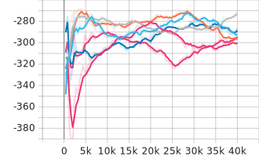

# KillFire: Forest Fire Suppression Simulator

A multi-agent RL environment using PettingZoo and RLlib, simulating forest fire suppression by helicopter, drone, and groundcrew.

## Features

- 20x20 grid world: tree, fire, suppressed states
- 3 agents: helicopter, drone, groundcrew, each with unique suppression ability
- Fire spreads probabilistically each step
- Shared team reward for fire suppression and penalty for burning
- Designed for multi-agent RL (single shared policy)
- Matplotlib grid visualization

## Setup

```bash
git clone https://github.com/dykwak94/KillFire.git
cd ~/KillFire
pip install -r requirements.txt
```
## Run default simulation
```bash
cd ~/KillFIre
PYTHONPATH=.. python main.py
```
## Train model
```bash
cd ~/KillFire/train
PYTHONPATH=.. python train_rllib.py
```
## Training Result (400 time steps per episode, 100 episodes)
### Parameters
`FIRE_SPREAD_PROB = 0.01`\
`initial_fires=3`


